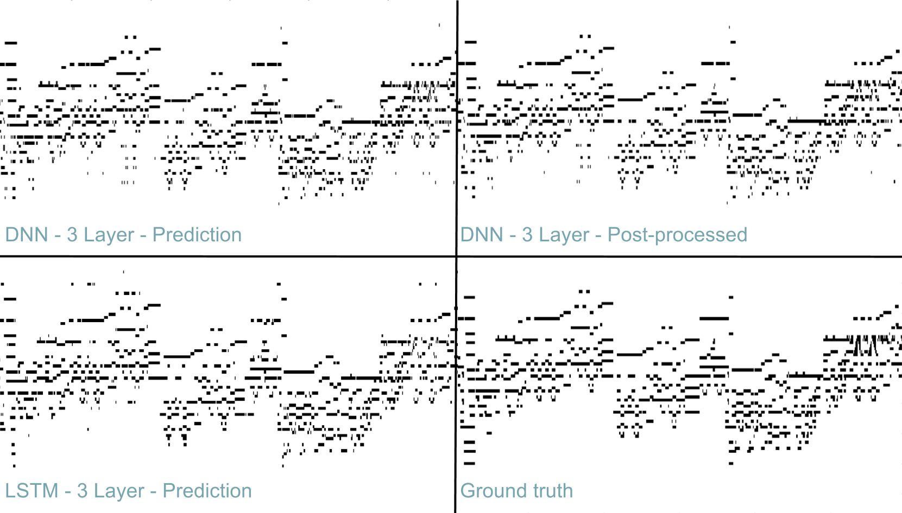

# Deep Neural Networks for Piano Music Transcription

DT2119 Speech and Speaker Recognition course's project at KTH Royal Institute of Technology.

#### Author: Diego González Morín.

Report : [Deep Neural Networks for Piano Music Transcription](Report/Draft-Diego-Gonzalez.pdf)
Poster: [Poster Sesion](Report/Poster.pdf)

## Abstract

In this project the main approaches of Automatic Music Transcription using Neural Networks are reviewed and explained. As an experimental study to these approaches, different models of Neural Networks are proposed to be compared for the application of Polyphonic Piano Music Transcription. This experimentation is first focused on the dataset preprocessing and alignment and is continued by a empirical comparison between Deep Neural Networks and Long Short-Term Memory (LSTM) Networks performances. The objective of the current project is to serve as a first step for future Neural Network design and optimization for Automatic Music Transcription by enclosing the best combination of methods and parameters for this particular task. 

## Introduction 

The main inspiration for the current work was got from the approach proposed by [Sigtia in 2015](https://arxiv.org/pdf/1508.01774.pdf). Several Neural networks architecture were proposed for the task of Automatic Polyphonic Piano Transcription, including DNN, RNN and CNNs. However, LSTM were no tested and the main objective of the current project was to compare the performance of difference LSTM with simple DNNs in the task of Automatic Music Transcription (AMT). 

## Dataset

MIDI Aligned Piano Music was used as the main dataset. For each audio WAV file, the correspondent MIDI file and a text file with pitches transcription was included. To train the network, the 270 classic piano pieces included in the dataset were used, splitting them first in Training, Validation and Test sets. 

## Data Preprocessing

The audio signals were downsampled from 44.1kHz to 16kHz to reduce the amount of data. Then, the Constant Q Transform was applied and the extracted features were normalized and the training mean, substracted from all the sets. 

## Experiments

The main experiment's goal was, as it was mentioned previously, to compare DNNs with LSTM networks. 8 Networks were build and trained in total : 

  - 4 DNNs: {1,2,3,4} layers and 256 units. 
  - 4 LSTMs: {1,2,3,4} layers and 256 units. 
  

## Training

Networks were built and trained using Keras with Tensor Flow backend using the following parameters: 

  - Adam optimizers
  - 20% Dropout
  - Early stopping with validation data
  
## Results

The best results are shown in the following table: 

|  Model | Size | Test Set |  F-measure  | Accuracy  | F-measure | Accuracy|
|:-------|:-----|:---------|:------------|:----------|:----------|:--------|
|  DNN   |   3L |  Set 1   |  69.36%     |  53.09%   |  70.61%   | 54.58%  |  
|  LSTM  |   3L |  Set 1   |  68.95%     |  52.61%   |  69.36%   | 53.09%  |
|  DNN   |   3L |  Set 2   |  65.29%     |  48.47%   |  66.54%   | 49.86%  |
|  LSTM  |   3L |  Set 2   |  66.05%     |  49.31%   |  66.37%   | 49.67%  |

And the plotted predictions for a 1m 30s subset of the test set: 

Finally, some famous songs were used as input to the network. The predictions for this song were transformed back to MIDI and gathered in the following video: 

